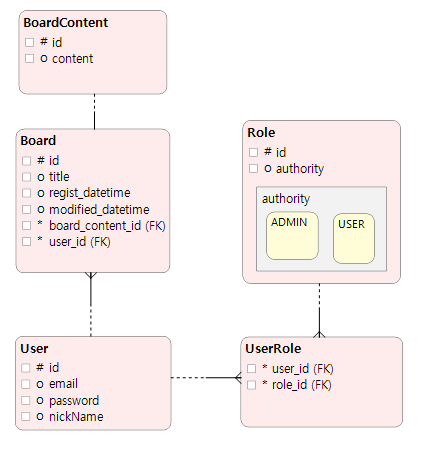
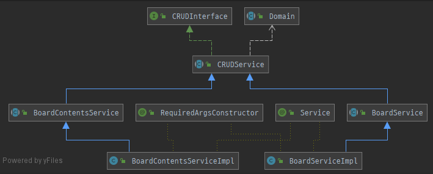

# 스프링 게시판 예제

<strong>프로젝트 구성시 기본 템플릿으로 사용하기 위한 프로젝트입니다.</strong>

## 프로젝트 개요   
### 1. 일반
   - 프로젝트명 : 스프링 로그인 게시판
  
   
### 2. 범위
   - 회원가입
   - 로그인
   - 게시글 등록, 수정, 삭제, 조회
 
   
### 3. 목표
   - 초상화된 JPA Data 회원가입, 로그인, 게시글에 대한 예제 샘플을 제공함으로써 프로젝트시 활용

## Development Environment
- JAVA 11
- Spring Boot 2.3.3
- Spring Security 5
- H2DB 1.4
- Maven 4.0
- JPA
- lombok
 
## Package Composition
- board : 게시판
- common : 추상화된 공통 CRUD
- siginin : 로그인, 회원가입, 권한, 보안

## Core Coomon Rogic Example
   
DB 구성도   
   
- common Package에 있는 CRUDService를 BoardSrvice에 상속하여 BoardServiceImpl과 같이 구현해서 사용
