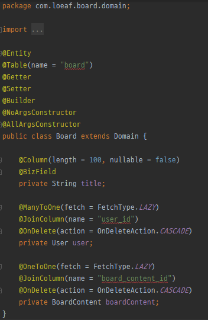
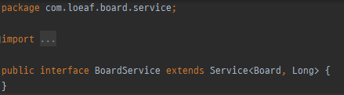
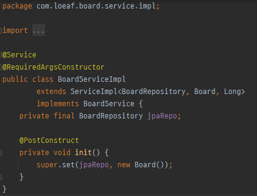

# 본직 식별자 기반 객체 설계를 통한 추상 CRUD

<string>Domain 단에서 본질 식별자 기반 설계 지원 및 CRUD JPA 추상화를 통한 개발 지원 템플릿</strong>

## 프로젝트 개요   
### 1. 일반
   - 프로젝트명 : 본질 식별자 기반 데이터 객체 설계를 통한 CRUD 게시판
   
### 2. 범위
   - 회원가입
   - 로그인
   - 게시글 등록, 수정, 삭제, 조회
  
### 3. 목표
   - 업무 식별자를 통한 초고속 DB 설계
   - Reflection을 통한 JPA ServiceImpl 추상화
   - 추상화된 JPA Data 회원가입, 로그인, 게시글에 대한 예제 샘플을 제공함으로써 프로젝트시 활용

## Development Environment
- JAVA 11
- Spring Boot 2.3.3
- Spring Security 5
- H2DB 1.4
- Maven 4.0
- JPA
- lombok
 
## Package Composition
- board : 게시판
- common : 추상화된 공통 CRUD
- siginin : 로그인, 회원가입, 권한, 보안

## Core Coomon Rogic Example
   
객체 설계시 RDB에서 유일성 보장을 위한 본질 식별자를 Bizkey Annotation을 통해 지정해 준다    
   
인터페이스에서 service를 상속받는다   
   
serviceImpl에서 serviceImpl을 상속받고 해당 Service를 구현 후 추상 Service에 객체 주입 

